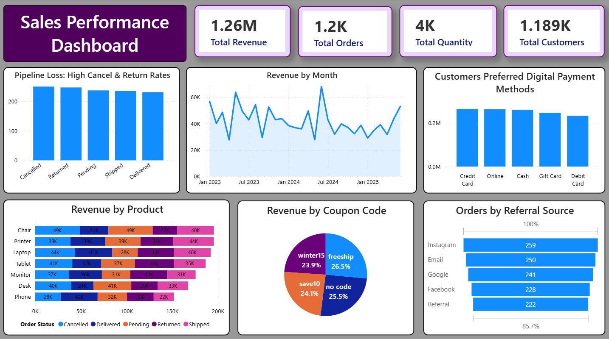

#  Data Analytics Project – Decodelabs Internship

This project was completed as part of the **Decodelabs Internship Program**, focusing on end-to-end data analytics using Python, SQL, and Power BI.

---

##  Task 1: Data Cleaning (Python)
- Handled missing values and duplicates  
- Standardized data formats  
- Validated TotalPrice calculations  

---

##  Task 2: Exploratory Data Analysis (EDA)
- Analyzed sales trends and customer behavior  
- Performed correlation analysis  
- Created visualizations (bar, line, pie charts, heatmaps)  

---

##  Task 3: SQL Analysis
- Wrote SQL queries for data extraction and insights  
- Used joins, grouping, and aggregations  
- Identified key business KPIs (revenue, top products, customers)  

---

##  Task 4: Power BI Dashboard
- Built interactive dashboard with KPIs and slicers  
- Visualized sales and order performance  
- Provided business insights for decision-making  

---

##  Tools & Technologies
Python, Pandas, SQL, Power BI, Jupyter Notebook  

---

##  Outcome
End-to-end data analytics workflow from data cleaning to dashboard reporting.
